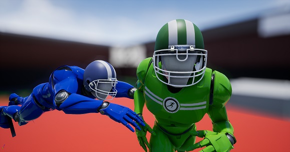

# Full Metal Runners
Full Metal Runners is a physics-based sports game with large-scale multiplayer built on top of a variety of different animation systems. It was developed as part of the University of Bristol Computer Science course 3rd year project (COMS30400).



## Installation

Prequistes:
* A git installation that includes the git LFS extension. Windows users are also reccomended to install a git credentials manager due to a known bug with git LFS
* Unreal engine 4.18 installation
* (Windows users) An up-to-date Visual Studio installation

1. Clone the repository

``` bash
$ git lfs clone https://github.com/Nick-Pearson/ParkourGame.git
```

2. Navigate to /ParkourGame/, and right click on ParkourGame.uproject. You should see an option to "Generate project files" for Visual Studio or XCode

3. Open the __ParkourGame.sln__ which will launch Visual Studio

4. Build and run the project using the Local Windows Debugger (press F5)

5. Once a build is sucessful the Unreal Editor will appear with the project already loaded for use

## Link Unreal to Git (optional)

Unreal can show version control information in the Editor

1. Click 'Source Control' from the main toolbar and select 'Connect to source control'

2. Select 'git (beta version)' from the provider dropdown, everything should auto populate. If not you may have to navigate manually to your git binary

